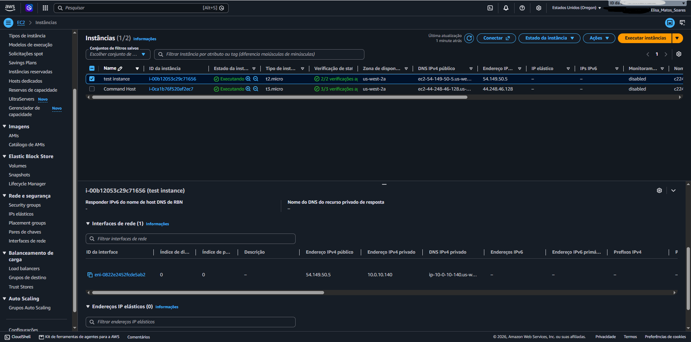
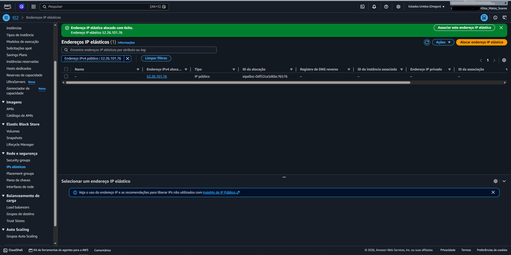
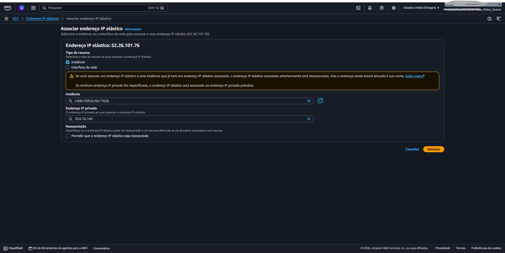
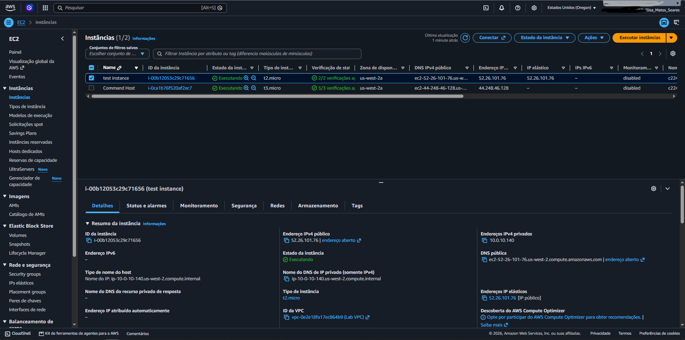

# Lab: Protocolos de internet – endereços dinâmicos e estáticos

## 🎯 Objetivo
Investigar o problema de endereçamento IP numa instância do Amazon EC2, compreender a diferença entre endereços IP estáticos e dinâmicos, e implementar uma solução utilizando um **Elastic IP (EIP)** para garantir um endereço IP persistente.

---

## 📋 Resumo do Cenário
Um cliente corporativo (Bob, Administrador da Nuvem) abriu um ticket de suporte relatando que o endereço IP público de uma das suas instâncias do EC2 muda aleatoriamente sempre que a instância é interrompida e reiniciada[cite: 2]. Esta alteração constante quebra as dependências da aplicação, tornando necessário um endereço IP estático.

---

## 🛠️ Passo a Passo Realizado

### Tarefa 1: Investigar e Replicar o Problema
1. **Criação da Instância:** Acedeu-se ao painel da Amazon EC2 e criou-se uma nova instância de teste com o nome `test instance`, utilizando a imagem **Amazon Linux 2023** e o tipo `t2.micro` (ou `t3.micro`).
2. **Configuração de Rede:** Selecionou-se a VPC do laboratório, a sub-rede pública com atribuição automática de IP público ativada, e o grupo de segurança `Linux Instance SG`.
3. **Teste de Comportamento Dinâmico:**
   * Após a instância entrar em estado de execução (`2/2`), anotou-se o endereço IPv4 público e privado na aba **Redes**.
   * A instância foi interrompida através da opção **Estado da instância** e, em seguida, reiniciada.
   * Observou-se que o endereço **IP privado permaneceu o mesmo**, mas o endereço **IP público mudou**, confirmando que o comportamento padrão da AWS atribui um IP público dinâmico.

### Resolução com Elastic IP (EIP)
1. No painel esquerdo do EC2, acedeu-se a **Redes e segurança > IPs elásticos**.
2. Criou-se um novo endereço IP elástico selecionando **Alocar endereço IP elástico**.
3. O EIP gerado foi associado à `test instance` através do menu **Ações > Associar endereço IP elástico**.
4. Validou-se que o EIP passou a ser o novo endereço IP público permanente da instância.
5. Realizou-se um novo ciclo de interrupção e arranque (`stop/start`) da instância para testar a persistência, comprovando que o IP público se manteve inalterado.

---

## 📌 Evidências do Laboratório

✅ **1. Instância criada e detalhe da aba Redes (IP dinâmico):**
    

✅ **2. Alocação do Elastic IP (EIP):**
    

✅ **3. Associação do EIP à instância do EC2:**
  

✅ **4. Comprovação do IP estático após reiniciar a instância:**
  

---

## 💡 Conclusão
O problema do cliente foi resolvido com sucesso. Explicou-se que as instâncias EC2 utilizam por defeito IPs públicos dinâmicos que mudam nos ciclos de reinicialização. A implementação de um **Elastic IP** forneceu o endereço IP estático e persistente necessário para estabilizar a arquitetura da empresa sem exigir que a instância ficasse permanentemente ligada.
