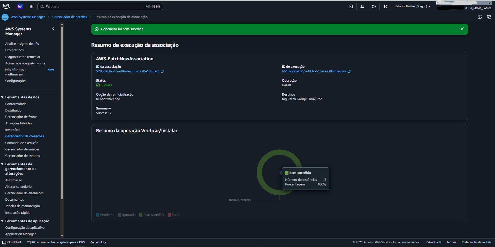
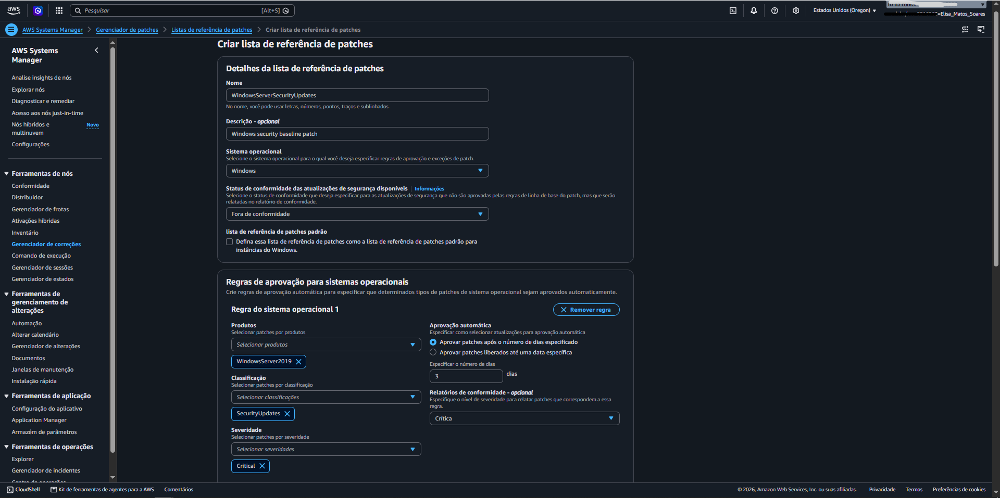
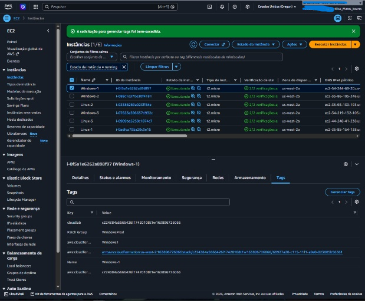
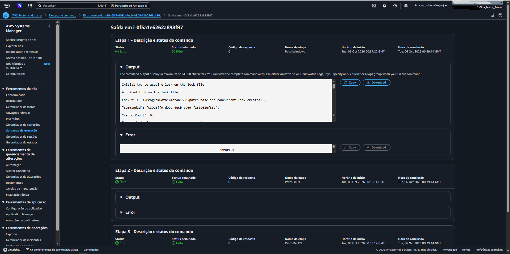
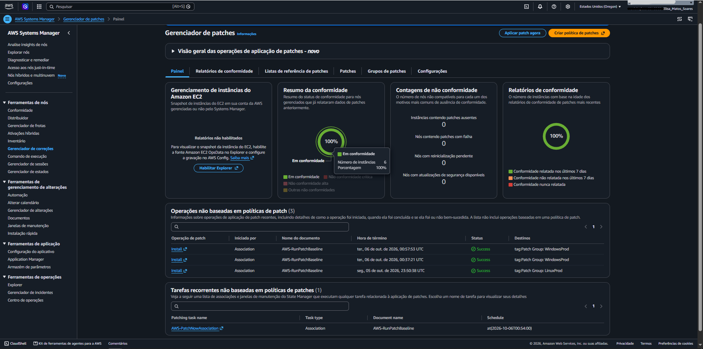
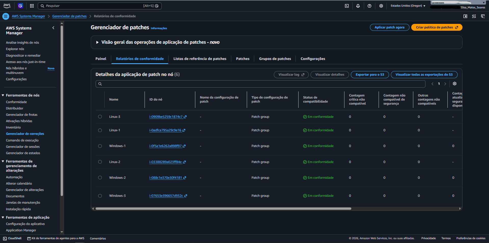

# 🛡️ Automação de Patches e Conformidade no AWS Systems Manager

Neste projeto prático, configurei e automatizei a rotina de patches e atualizações de segurança para uma frota mista de instâncias EC2 (**Amazon Linux** e **Windows Server**) utilizando o **AWS Systems Manager (SSM)**.

O foco principal foi demonstrar como aplicar correções em massa sem precisar abrir portas de acesso remoto (como SSH ou RDP) e como monitorizar a conformidade dos servidores num painel centralizado.

---

## 🎯 O Que Foi Feito

1. **Gestão dos nós com Fleet Manager:** Validação da frota e permissões das instâncias via SSM Agent.
2. **Atualização rápida no Linux:** Aplicação imediata de patches nas máquinas Amazon Linux com a baseline nativa da AWS.
3. **Baseline personalizada para Windows Server 2019:** Criação de regras específicas para aprovar apenas atualizações críticas e de segurança após 3 dias de validação.
4. **Segmentação por Patch Groups:** Associação das instâncias às suas respetivas políticas através de tags.
5. **Auditoria de segurança:** Validação de 100% de conformidade de toda a frota no painel do Patch Manager.

---

## 🛠️ Tecnologias e Serviços Utilizados

- **AWS Systems Manager:**
  - **Fleet Manager:** Inventário e visão operacional dos nós.
  - **Patch Manager:** Criação de baselines e agendamento de correções.
  - **Run Command (`AWS-RunPatchBaseline`):** Execução remota das rotinas de patch sob o capô.
  - **Compliance:** Monitorização de nós conformes e não conformes.
- **Amazon EC2:** Servidores Linux e Windows Server 2019.
- **IAM:** Políticas e funções para comunicação segura com o Systems Manager.

---

## 📸 Passo a Passo e Evidências Práticas

### 1. Atualização das Instâncias Linux (Baseline Padrão)

A primeira etapa consistiu em atualizar os nós Linux utilizando a baseline recomendada pela própria AWS (`AWS-AmazonLinux2DefaultPatchBaseline`). 

Acedi ao **Patch Manager**, utilizei a opção **Patch now** com a ação `Scan and install` e direcionei a execução especificamente para as máquinas com a tag `Patch Group = LinuxProd`.

  
   
  <em>Figura 1: Execução concluída com sucesso nas 3 instâncias Linux com a associação AWS-PatchNowAssociation.</em>

---

### 2. Criação da Baseline Personalizada para Windows

Para as máquinas Windows, criei uma baseline própria chamada `WindowsServerSecurityUpdates`. Em ambientes corporativos, é comum aguardar alguns dias antes de instalar atualizações recentes para evitar incompatibilidades. Por isso, defini:

- **Classificação:** Apenas `SecurityUpdates`.
- **Severidade:** Regras dedicadas para `Critical` e `Important`.
- **Aprovação automática:** 3 dias após a disponibilização pela Microsoft.
- **Vinculação:** Associei esta baseline ao grupo de patches `WindowsProd`.

  
   
  <em>Figura 2: Definição das regras de aprovação e severidade para a baseline personalizada de Windows Server.</em>

---

### 3. Associação das Tags no EC2 e Execução

Para que o Systems Manager identifique quais servidores seguem a nova política do Windows, configurei a tag necessária no console do EC2:

- **Key:** `Patch Group`
- **Value:** `WindowsProd`

  
   
  <em>Figura 3.1: Aplicação da tag Patch Group na instância Windows para integração com a baseline criada.</em>

Com as tags aplicadas, executei novamente o **Patch now** para o grupo `WindowsProd`. Sob o capô, o Systems Manager chama o **Run Command** com o documento `AWS-RunPatchBaseline` para efetuar a verificação e instalação em segundo plano:

  
   
  <em>Figura 3.2: Logs da etapa PatchWindows executada sem erros via Run Command diretamente no nó gerenciado.</em>

---

### 4. Auditoria e Painel de Conformidade

Após a finalização das tarefas, validei a postura de segurança de todo o ambiente no **Patch Manager**.

No separador **Painel**, todas as operações foram concluídas com êxito e os indicadores gerais atingiram **100% de conformidade**:

  
   
  <em>Figura 4.1: Painel consolidado confirmando 100% de conformidade na frota e zero vulnerabilidades pendentes.</em>

No separador **Relatórios de conformidade**, consultei a relação nominal dos servidores gerenciados, confirmando que as 6 máquinas (3 Linux e 3 Windows) constavam com o status individual de conformidade atingido:

  
   
  <em>Figura 4.2: Visão detalhada por nó confirmando zero pendências críticas em todas as instâncias da frota.</em>

---

## 💡 Aprendizados e Boas Práticas

- **Segurança Operacional:** Toda a administração foi realizada sem expor portas administrativas à internet (como as portas `22` ou `3389`), reduzindo a superfície de ataque da infraestrutura.
- **Governança via Tags:** O uso de `Patch Groups` permite gerir frotas extensas de forma declarativa, aplicando políticas distintas (por exemplo, desenvolvimento vs. produção) apenas alterando tags nas instâncias.
- **Auditoria Simplificada:** Em vez de verificar relatórios locais máquina por máquina, o Systems Manager consolida todo o status de segurança num painel unificado, pronto para auditorias e conformidade contínua.